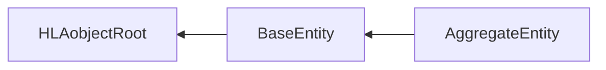
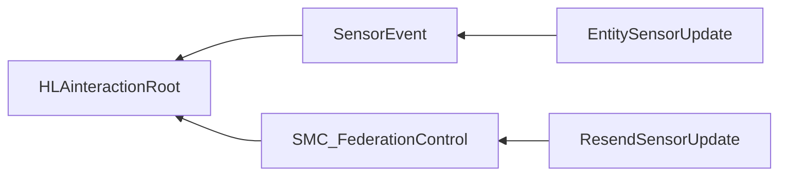

# NETN-ENTITY
|Version| Date| Dependencies|
|---|---|---|
|v3.0|2023-11-19|NETN-BASE|

The NETN-ENTITY FOM Module provides a standard interface for representing simulation entities in a federated distributed simulation. The module extends the RPR-FOM standard SISO-STD-001-2015 with additional attributes for simulated physical and aggregated entities.

The specification is based on IEEE 1516 High Level Architecture (HLA) Object Model Template (OMT) and supports interoperability in a federated simulation (federation) based on HLA.

For backward compatibility, published objects should include all required RPR-FOM attributes.

## Object Classes

Note that inherited and dependency attributes are not included in the description of object classes.

### BaseEntity

A base class of aggregate and discrete scenario domain participants. The BaseEntity class is characterized by being located at a particular location in space and independently movable, if capable of movement at all. It specifically excludes elements normally considered to be a component of another element. The BaseEntity class is intended to be a container for common attributes for entities of this type. Since it lacks sufficient class specific attributes that are required for simulation purposes, federates cannot publish objects of this class. Certain simulation management federates, e.g. viewers, may subscribe to this class. Simulation federates will normally subscribe to one of the subclasses, to gain the extra information required to properly simulate the entity.

|Attribute|Datatype|Semantics|
|---|---|---|
|Callsign|HLAunicodeString|Optional: The callsign is a unique-designator. The default is using the RPR-FOM `PhysicalEntity` attribute `Marking` or the `AggregateEntity` attribute `AggregateMarking`. Max length 21 characters.|
|Symbol|SymbolStruct|Optional. A symbol identifier and additional amplification. If not provided, derive the default value from the `BaseEntity` attribute `EntityType` and `PhysicalEntity` or `AggregateEntity` attribute `ForceIdentifier`.|
|HostEntity|UUID|Optional. Reference to the simulation entity this platform is mounted on or embedded in. The default is no host entity (all zeros UUID).|
|Cover|PercentFloat32|Optional. The protection describes the entity's cover status from the effects of weapons fire. The default is 0% - fully affected by weapon fire.|
|Signatures|ArrayOfSignature|Optional: A set of signatures to characterize this entity's susceptibility to detection.|
|Sensors|ArrayOfSensor|Optional: A set of sensors associated with the entity.|
|CaptureStatus|CaptureStatusEnum8|Optional: The status of an entity's level of control or influence over its activities. The default is Not-Captured.|

### AggregateEntity

A group of one or more separate objects that operate together as part of an organization. These objects may be discrete, may be other aggregate objects, or may be a mixture of both.

|Attribute|Datatype|Semantics|
|---|---|---|
|Echelon|EchelonEnum32|Optional. Use the echelon symbol-modifier to specify the size of the AggregateEntity (level of command).|
|CombatValue|PercentFloat32|Optional. A summary value of the effectiveness (the level of training, leadership, morale, personnel and equipment operational status). The default value is 100%.|
|WeaponsControlOrder|WeaponControlOrderEnum8|Optional. Describes current Weapon Control Order as Free, Tight, or Hold. The default is 0 - Other.|

## Interaction Classes

Note that inherited and dependency parameters are not included in the description of interaction classes.

### SensorEvent

A sensor related event such as a sensor detection, alarm etc.

|Parameter|Datatype|Semantics|
|---|---|---|
|Entity|UUID|Required: Reference to the entity generating the related event|

### EntitySensorUpdate

Report on a unit's awareness of spotted entities.

|Parameter|Datatype|Semantics|
|---|---|---|
|Tracks|ArrayOfTrack|Required. Spotted entities at the time specified in the parameter 'When'.|
|SensorType|EntityTypeStruct|Required. The type of the sensor that detected the entities.|

### SMC_FederationControl

### ResendSensorUpdate

Request all sensor services to resend their latest sensor update.

## Datatypes

Note that only datatypes defined in this FOM Module are listed below. Please refer to FOM Modules on which this module depends for other referenced datatypes.

### Overview
|Name|Semantics|
|---|---|
|ArrayOfDetectedEquipment|An array with spotted equipment at the spotted entity.|
|ArrayOfSensor|Array with definitions of sensors.|
|ArrayOfSignature|A set of signatures to characterize this entity's susceptibility to detection.|
|ArrayOfTrack|A list of tracks representing an aggregate output from a sensor's detections.|
|CaptureStatusEnum8|The status of a simulated entity concerning their control or influence over their activities.|
|DetectedEquipment|Equipment at the spotted entity.|
|IdentificationLevelEnum8|The identification level of an object.|
|RangeFloat32|Range of sensor|
|SensorStateEnum32|The emission states of aggregate sensors|
|SensorStruct|Defines a sensor's operational status, damage status, and coverage.|
|SignatureTypeEnum8|Different types of signatures.|
|SignatureVariant|Different types of signatures that describes detectability using different types of sensors, e.g. Direct Visual Optics, Image Intensifiers, Thermal, etc.|
|TrackStruct|Descripton of the observed entity. The symbol contains information about the spotted entity's relation to the spotter and details about the type and echelon at the spotted entity.|
|WeaponControlOrderEnum8|The enumerations for weapon control|
        
### Simple Datatypes
|Name|Units|Semantics|
|---|---|---|
|RangeFloat32|meters|Range of sensor|
        
### Enumerated Datatypes
|Name|Representation|Semantics|
|---|---|---|
|CaptureStatusEnum8|HLAoctet|The status of a simulated entity concerning their control or influence over their activities.|
|IdentificationLevelEnum8|HLAoctet|The identification level of an object.|
|SensorStateEnum32|HLAinteger32BE|The emission states of aggregate sensors|
|SignatureTypeEnum8|HLAinteger32BE|Different types of signatures.|
|WeaponControlOrderEnum8|HLAoctet|The enumerations for weapon control|
        
### Array Datatypes
|Name|Element Datatype|Semantics|
|---|---|---|
|ArrayOfDetectedEquipment|DetectedEquipment|An array with spotted equipment at the spotted entity.|
|ArrayOfSensor|SensorStruct|Array with definitions of sensors.|
|ArrayOfSignature|SignatureVariant|A set of signatures to characterize this entity's susceptibility to detection.|
|ArrayOfTrack|TrackStruct|A list of tracks representing an aggregate output from a sensor's detections.|
        
### Fixed Record Datatypes
|Name|Fields|Semantics|
|---|---|---|
|DetectedEquipment|Type, NumberOfEquipment|Equipment at the spotted entity.|
|SensorStruct|SensorId, SensorType, SensorStateEnum, SensorDamageState, SensorCoverage|Defines a sensor's operational status, damage status, and coverage.|
|TrackStruct|Track, Entity, IdentificationLevel, Equipment, Location, Orientation, Speed, Activity, Symbol|Descripton of the observed entity. The symbol contains information about the spotted entity's relation to the spotter and details about the type and echelon at the spotted entity.|
        
### Variant Record Datatypes
|Name|Discriminant (Datatype)|Alternatives|Semantics|
|---|---|---|---|
|SignatureVariant|Signature (SignatureTypeEnum8)|DVO, I2, Thermal, HUMINT, Electronic|Different types of signatures that describes detectability using different types of sensors, e.g. Direct Visual Optics, Image Intensifiers, Thermal, etc.|
    